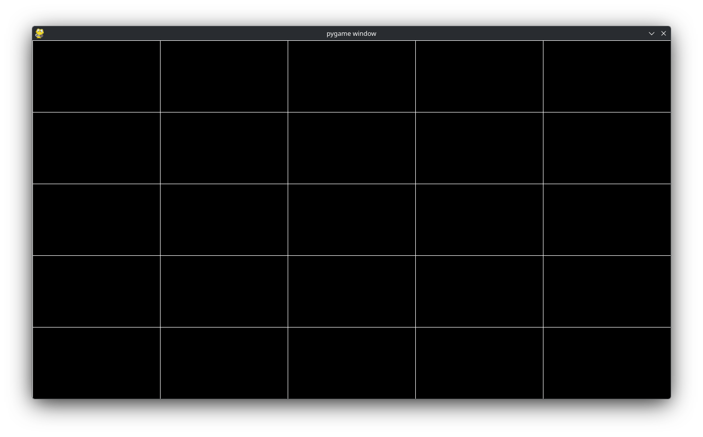
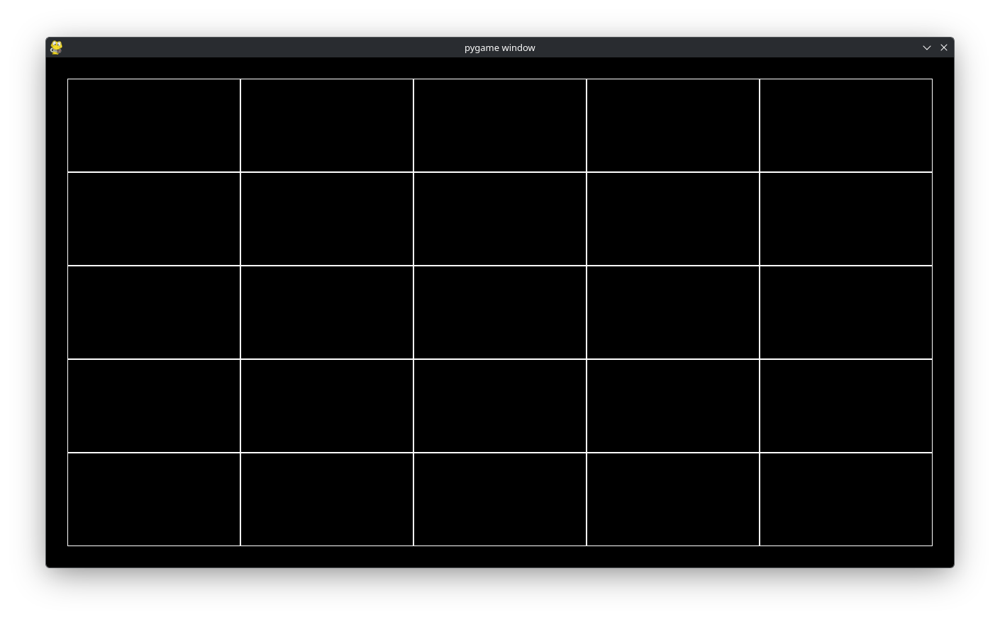

The Basics: Getting a Grid (Pygame)
===================================

Consider the following introductory example from `Pygame-ce <https://pyga.me/docs/>`_:

.. code-block:: python

   import pygame

   # pygame setup
   pygame.init()
   screen = pygame.display.set_mode((1280, 720))
   clock = pygame.time.Clock()
   running = True
   
   while running:
       # poll for events
       # pygame.QUIT event means the user clicked X to close your window
       for event in pygame.event.get():
           if event.type == pygame.QUIT:
               running = False

       # fill the screen with a color to wipe away anything from last frame
       screen.fill("purple")

       # RENDER YOUR GAME HERE

       # flip() the display to put your work on screen
       pygame.display.flip()

       clock.tick(60)  # limits FPS to 60
   
   pygame.quit()

It currently displays a purple screen. Let us adapt this to draw a ``(5, 5)`` grid across the entire screen. We start of with some imports:

.. code-block:: python

   from lpyout import Grid
   from lpyout.pygame import screen_wrapper
   from lpyout.pygame.render import fast_render

The first import gives us the ability to create ``Grid`` objects. Each ``Grid`` object should be contained in a ``Screen`` (that is, the actual viewport, such as a window). We provide some defaults for ``pygame``. The second import gives us the entire window created by ``pygame``. Lastly, a ``Grid`` object just stores coordinates, so we implement some basic rendering routines for ``pygame`` that actually let you display the grid.

Now, after ``running = True`` add:

.. code-block:: python

   screen_wrapper.update()
   grid = Grid.fill_screen(screen_wrapper, 5, 5)

``screen_wrapper.update()`` gets the dimensions of the current ``pygame`` window. Because there are *so* many ways to make a grid, we have various class methods that act as simplified constructors. ``fill_screen`` makes the grid fill the specified screen (which in our case, fills the window).

Now, replace ``screen.fill("purple")`` with ``screen.fill("black")`` and right below it add:

.. code-block:: python

       # fill the screen with a color to wipe away anything from last frame
       screen.fill("black")
    
       # Render grid
       screen_wrapper.update()
       fast_render(grid, screen)

Like above, in case the window changes size, we ``.update`` the ``screen_wrapper`` object. Lastly, we make a call to ``fast_render(grid, screen)`` to actually render the grid! You should get a screen that resembles:

=======
Margins
=======

Full screen is nice, but a lot of interfaces do not operate on precisely fullscreen. Instead, there might be a little nudge to make it a bit smaller (or larger) depending on what we want. There are a couple ways to deal with this, let's focus on *margins*. Change:

.. code-block:: python

   grid = Grid.fill_screen(screen_wrapper, 5, 5)

to:

.. code-block:: python

   grid = Grid.fill_screen(screen_wrapper, 5, 5, m=30)

This will change the grid to:

What did we do? We created a grid that was fullscreen and by specifying ``m=30`` we said shrink each side of the grid by ``30px``. Internally, setting ``m=30`` changes the ``x``, ``y``, ``w``, and ``h`` of the grid we made.

.. important::
   
   ``grid.x``, ``grid.y``, ``grid.w``, and ``grid.h`` always reflect the raw coordinates *after* applying margins to the grid.

=======
Padding
=======

Padding is related to margin. As mentioned before, margin changes the grid's ``x``, ``y``, ``w``, and ``h``. Padding on the otherhand, changes the children ``x``, ``y``, ``w``, and ``h``. The distinction is exceptionally important for ``fast_render`` because ``fast_render`` only uses the grid's ``x``, ``y``, ``w``, and ``h`` to render the grid. Thus, changing

.. code-block:: python

   grid = Grid.fill_screen(screen_wrapper, 5, 5)

to

.. code-block:: python

   grid = Grid.fill_screen(screen_wrapper, 5, 5, p=30)

will render like the very first example (i.e. completely fullscreen). To rectify this, we can use ``render_recursive`` instead of ``fast_render``. ``render_recursive`` renders each individual ``Cell`` as a square. Furthermore, when we run ``Grid.fill_screen(...)`` we create a grid with ``5 x 5 = 25`` ``Cells``. ``render_recursive`` finds every cell in a grid and performs some operation based on the *cell* and *not* the parent grid. We will cover this more in detail why this is important. But switching out ``fast_render`` with ``render_recursive`` will give:

In essence, visually the same thing as the previous example, but internally, the coordinates are different. For the previous example, the parent's coordinates and dimensions are modified (indirectly modifying the children), in this example only the children coordinates are modified and the parent's coordinates and dimensions remain the same.
