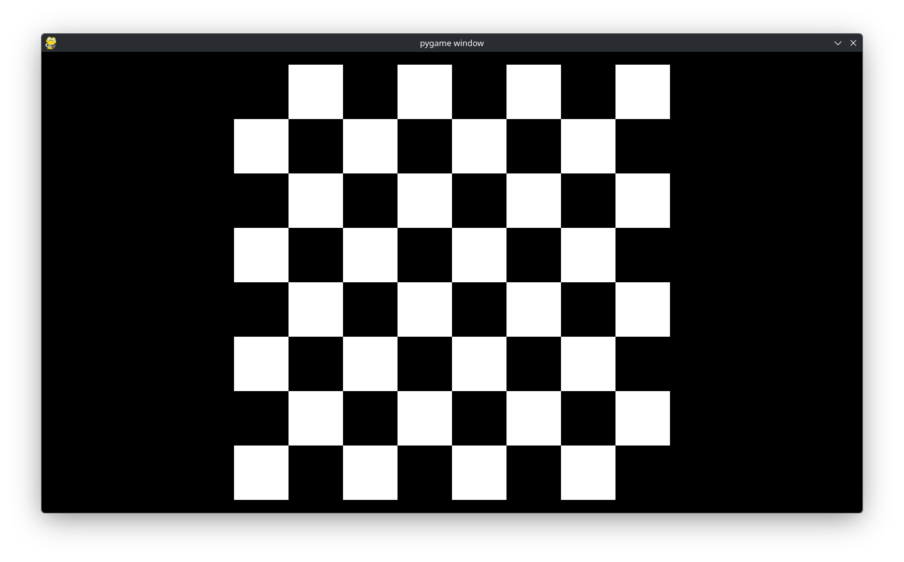

Custom Drawing
==============

We now discuss how you can *manually* draw grids to make them look like how you want them in, say, a game via some examples.

==========
Chessboard
==========

Suppose we want to draw a chessboard for a game that looks like:

First, (TODO).
