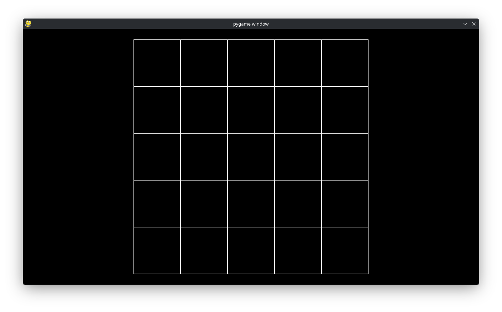

Custom Drawing
==============

We now discuss how you can *manually* draw grids to make them look like how you want them in, say, a game via some examples.

==========
Chessboard
==========

Suppose we want to draw a chessboard for a game that looks like:

.. image:: chessboard.png

First, we recall a previous example:

.. code-block:: python

   # Example file showing a basic pygame "game loop"
   import pygame
   from lpyout import Grid
   from lpyout.pygame import screen_wrapper
   from lpyout.pygame.render import render_recursive

   # pygame setup
   pygame.init()
   screen = pygame.display.set_mode((1280, 720))
   clock = pygame.time.Clock()
   running = True

   # Initialize grid:
   screen_wrapper.update()
   grid = Grid.fill_screen(screen_wrapper, 5, 5, m=30)

   while running:
       # poll for events
       # pygame.QUIT event means the user clicked X to close your window
       for event in pygame.event.get():
           if event.type == pygame.QUIT:
               running = False

       # fill the screen with a color to wipe away anything from last frame
       screen.fill("black")
    
       # Render grid
       screen_wrapper.update()
       render_recursive(grid, screen)

       # flip() the display to put your work on screen
       pygame.display.flip()

       clock.tick(60)  # limits FPS to 60
   
   pygame.quit()

Recall this gives

.. image:: lpyout_fast_margin.png

Our first task will be to make the chessboard a square. To do so, change

.. code-block:: python

   grid = Grid.fill_screen(screen_wrapper, 5, 5, m=30)

to

.. code-block:: python

   grid = Grid.fill_square(screen_wrapper, 5, 5, m=30)

The ``Grid.fill_square(...)`` class fills the container (in this case the screen) with a square that is large as possible. This visually gives

Now we come to the custom drawing part. Instead of doing

.. code-block:: python
       
       render_recursive(grid, screen)

we will want to replace this with our own custom function. So replace it with

.. code-block:: python

       chess_render(grid, screen)

Or whatever you want to call your custom rendering function. There are a couple ways to implement ``chess_render`` we will go over two methods. We define

.. code-block:: python

   def chess_render(grid: Grid, surface):
       ...

That is, our ``chess_render`` will take in the grid we made and (because Pygame requires it) the surface we want to render it to. In ``lpyout`` you can iterate over each subgrid just as you would with a list in Python. So we write

.. code-block:: python

   def chess_render(grid: Grid, surface):
       for cell in grid:
           ...

.. note:: Because our grid only has ``Cell`` objects as children, we write ``for cell in grid:``. In general, the children may also be ``Grid`` objects too.

There is an easy way to figure out which color each cell should be.

- If the sum of the cell's index in the grid is odd the cell is white.
- Otherwise, the cell is black.

Because the background is already black, we can simply ommit drawing when the index sum is even. Thus, ``chess_render`` becomes

.. code-block:: python

   def chess_render(grid: Grid, surface):
       for cell in grid:
           if sum(cell.index) % 2 == 1:
               rect = pygame.Rect(cell.x, cell.y, cell.w, cell.h)
               pygame.draw.rect(surface, (255, 255, 255), rect, 0)

This gives

.. image:: chessboard.png

as desired.

This method used iteration to create the chessboard. We also illustrate a more functional approach using ``grid_map``. First, do not forget to import ``grid_map``:

.. code-block:: python

   from lpyout import Grid, grid_map

Then we may rewrite ``chess_render`` as

.. code-block:: python

   def chess_render(grid: Grid, surface):
       def render(cell: Cell):
           if sum(cell.index) % 2 == 1:
               rect = pygame.Rect(cell.x, cell.y, cell.w, cell.h)
               pygame.draw.rect(surface, (255, 255, 255), rect, 0)

        grid_map(render, grid)

Recall that, internally, ``Grid`` objects are represented as trees with the leaves being ``Cell`` objects. ``grid_map`` applies a function (in our case ``render``) to each *leave* of the ``Grid`` object. In otherwords, any ``Cell`` object that descends from the grid we are mapping over has ``render`` applied to it. In code, ``grid_map`` is a simple recursive function

.. code-block:: python

   def grid_map(f: Callable[[Cell], Any], grid: Grid):
       if isinstance(grid, Cell):
           f(grid)
       else:
           for subgrid in grid:
               grid_map(f, subgrid)

but it is so useful, we provide it for you.
